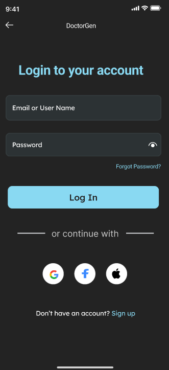
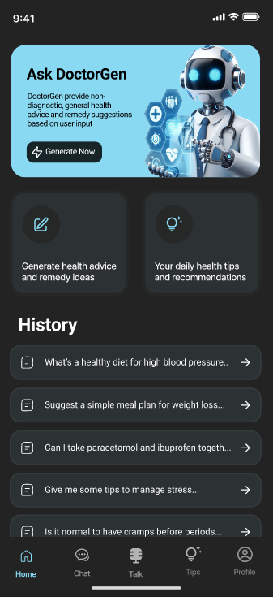
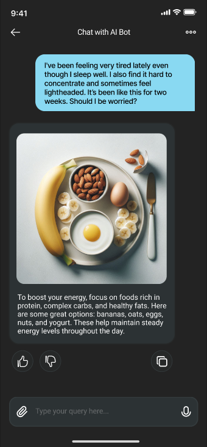
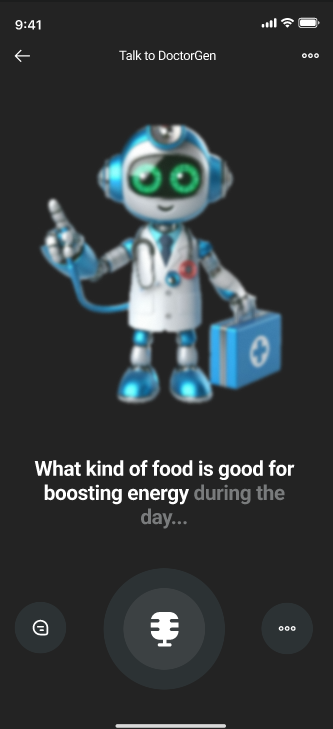
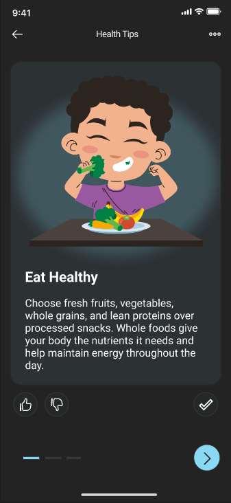
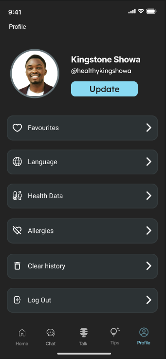
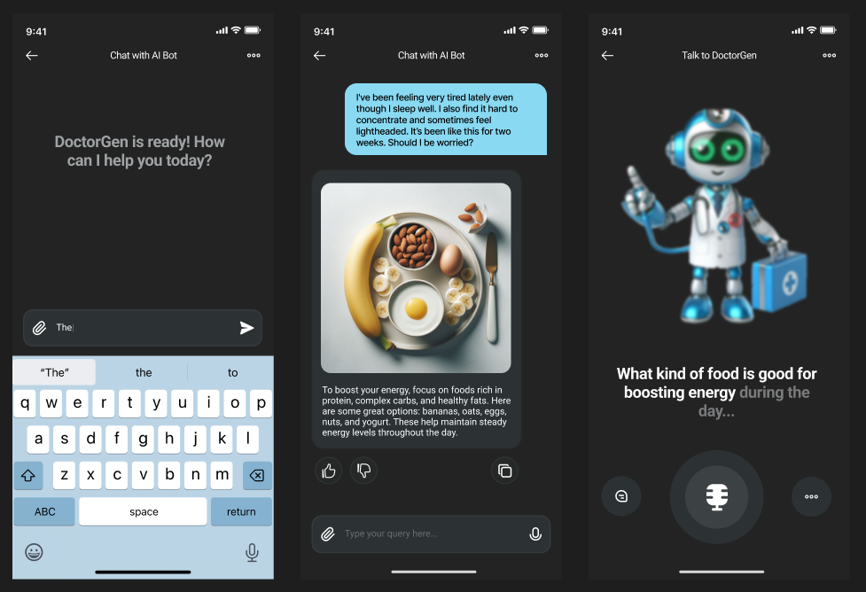
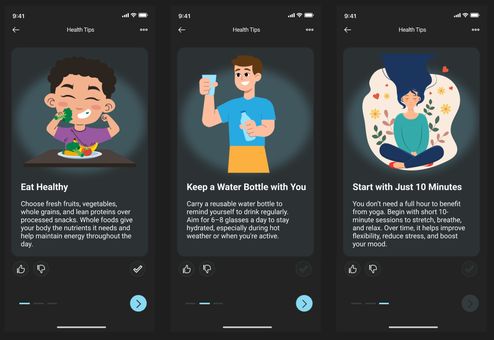

# DoctorGen App

DoctorGen App is a Flutter-based AI health assistant mobile application that allows users to chat with a medical assistant bot, speak to the bot using voice, receive AI-generated daily health tips, manage profile information, and store conversation history locally.

> Disclaimer: DoctorGen is an educational and portfolio project. It is not a replacement for professional medical advice, diagnosis, or treatment. Users should consult a qualified healthcare professional for medical concerns.

## Overview

DoctorGen App is designed as a conversational health assistant that uses Google Gemini AI to provide simple, patient-friendly responses to health-related questions. The application supports text-based conversations, image-assisted prompts, voice interaction, text-to-speech responses, local chat history, user profiles, and personalized daily tips.

The project demonstrates mobile app development with Flutter, AI integration, local persistence using SQLite, secure local session storage, and user-focused healthcare UI design.

<h2>Screenshots</h2>

<table>
  <tr>
    <td></td>
    <td></td>
    <td></td>
  </tr>
  <tr>
    <td align="center">Login</td>
    <td align="center">Home</td>
    <td align="center">AI Chat</td>
  </tr>
  <tr>
    <td></td>
    <td></td>
    <td></td>
  </tr>
  <tr>
    <td align="center">Voice Assistant</td>
    <td align="center">Health Tips</td>
    <td align="center">Profile</td>
  </tr>
</table>

### Additional Screens





## Key Features

- AI-powered medical assistant chat
- Google Gemini integration
- Text-based chat interface
- Image-supported prompts using gallery image picker
- Voice input using speech-to-text
- Spoken bot responses using text-to-speech
- Chat history saved locally
- Chat deletion support
- Personalized daily health tips
- Tips generated based on recent chat topics
- User registration and login
- Local user profile management
- Secure local session storage
- Health data and preferences database structure
- Dark theme UI
- Custom widgets for messages, action cards, bottom navigation, and profile sections
- Multi-platform Flutter project structure

## Tech Stack

- **Framework:** Flutter
- **Language:** Dart
- **AI Integration:** Google Gemini
- **AI Packages:** `flutter_gemini`, `google_generative_ai`, `flutter_ai_toolkit`
- **Local Database:** SQLite using `sqflite`
- **Local Secure Storage:** `flutter_secure_storage`
- **Voice Input:** `speech_to_text`
- **Text-to-Speech:** `flutter_tts`
- **Image Input:** `image_picker`
- **UI:** Material Design, Google Fonts, Flutter SVG
- **State / Utilities:** Flutter widgets, services, local models
- **Platforms:** Android, iOS, Web, Linux, macOS, Windows

## Project Structure

```text
doctor_gen_app/
├── android/
├── assets/
│   ├── icons/
│   └── images/
├── ios/
├── lib/
│   ├── config/
│   ├── data/
│   ├── database/
│   │   └── db_helper.dart
│   ├── models/
│   ├── pages/
│   │   ├── chat_with_bot_page.dart
│   │   ├── edit_profile_page.dart
│   │   ├── home_page.dart
│   │   ├── login_page.dart
│   │   ├── profile_page.dart
│   │   ├── sign_up_page.dart
│   │   ├── speak_to_bot_page.dart
│   │   └── tips_page.dart
│   ├── services/
│   │   ├── auth_service.dart
│   │   ├── chat_service.dart
│   │   ├── tip_service.dart
│   │   └── user_service.dart
│   ├── widgets/
│   ├── consts.dart
│   └── main.dart
├── linux/
├── macos/
├── test/
├── web/
├── windows/
├── pubspec.yaml
└── README.md
